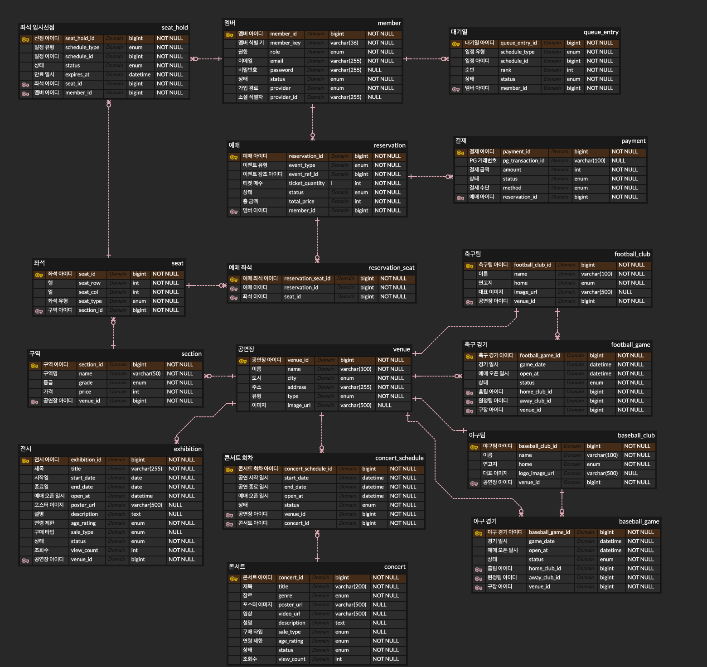

# interpark-clone
인터파크 티켓 클론코딩 프로젝트

---

## 1. 프로젝트 개요

**목적**

> 인터파크 티켓(NOL 티켓) 스타일의 예매 서비스를 뼈대로 삼아, 백엔드 성능 엔지니어링 학습용 프로젝트이다.
> 도메인을 완성도 있게 복제하는 것 자체가 목표가 아니라, **동시성 제어 / 실행계획 분석 / 결제 연동 / 소셜 로그인 / Redis 캐싱 / 트랜잭션 관리 / CI/CD / 부하테스트 / 스레드풀 튜닝 / 쿼리 개선**을 실전처럼 다뤄보기 위한 그릇으로 도메인을 사용한다.

**도메인 스코프**

- 콘서트
- 스포츠 (야구, 축구)
- 전시/행사

**학습 로드맵**

| 주차 | 내용 |
|---|---|
| 1주 | 회원/인증(소셜로그인 포함), 도메인 조회 API(콘서트/야구/축구/전시행사), 기본 CRUD |
| 2주 | 좌석선점~결제~확정 트랜잭션 흐름 완성 (락 없는 기본 버전), PG 연동 |
| 3주 | 동시성 제어 여러 버전 구현 + 부하테스트 + 스레드풀/커넥션풀 튜닝 |
| 4주 | 쿼리 실행계획 분석/최적화, Redis 캐싱 적용, CI/CD 배포, 라이트 도메인에 엔진 연결 |

---

## 2. 기능 명세 (도메인별 서비스 기능)

### 2.1 회원/인증
- 이메일 회원가입 / 로그인 (JWT 발급, Refresh Token 재발급)
- 소셜 로그인 (카카오 또는 구글)
- 내 정보 조회/수정
- 관리자(ADMIN) 계정 분리 및 권한 체크

### 2.2 콘서트 (메인 도메인)
- 서브 장르: 발라드, 락/메탈, 랩/힙합, 재즈/소울, 디너쇼, 포크/트로트, 내한공연, 페스티벌, 팬클럽/팬미팅, 인디, 토크/강연
- 목록 조회 (랭킹순 정렬), 상세 조회 (이미지, 일자, 장소, 출연진)
- 좌석 배치도 조회 (구역별 그리드, 좌석 상태 실시간 반영)
- 좌석 선택 → 임시 선점 → 결제 → 확정
- 예매 내역 조회 / 취소

### 2.3 야구 (메인 도메인)
- 팀 목록(10개 구단), 구장 목록
- 팀별 / 구장별 경기 일정 조회
- 좌석: 기본 동일 크기, 일부 구역만 special 좌석으로 가격 차등
- 좌석 선택 → 임시 선점 → 결제 → 확정 (콘서트와 동일 엔진, 가격 정책만 다름)
- 예매 내역 조회 / 취소

### 2.4 축구 (라이트 도메인)
- 팀 목록, 경기장 목록
- 팀별 / 경기장별 경기 일정 조회
- 예매: 야구 예매 엔진 재사용

### 2.5 전시/행사 (라이트 도메인)
- 지정좌석 없이 기간 내 자유 관람권 형태로 가정
- 목록 조회 (최신순 / 할인율순 / 종료임박순), 상세 조회 (이미지, 전시 기간, 장소)
- 예매: 좌석선점 없이 수량 기반 예약 (인원수 선택 → 결제 → 확정), 결제 모듈만 재사용

### 2.6 결제 (공통)
- 결제 요청 생성 (PG 연동)
- 결제 승인 콜백/웹훅 처리
- 결제 실패 처리 → 좌석 선점 해제 / 수량 복구
- 결제 취소/환불

### 2.7 대기열 (콘서트/야구, 동시성 실험용)
- 예매 오픈 시각 도달 시 대기열 진입 (토큰 발급)
- 순번 조회 (polling 또는 SSE)
- 순번 도달 시 예매 페이지 입장 허용

---

## 3. 공부할 내용

### 3.1 동시성 제어
- 비관적 락 (`SELECT ... FOR UPDATE`) — 락 대기, 데드락
- 낙관적 락 (`@Version`) — 충돌 감지와 재시도 전략
- 분산 락 (Redisson `RLock`) — 멀티 인스턴스 환경에서의 정합성
- 대기열 (Redis Sorted Set) — 트래픽 자체를 제한하는 접근
- 동일한 좌석 선점 API에 대해 네 가지 전략을 갈아끼우며 정합성/성능 비교

### 3.2 쿼리 실행계획 분석 & 최적화
- `EXPLAIN ANALYZE`로 실행계획 읽는 법 (Seq Scan vs Index Scan vs Bitmap Index Scan, 조인 전략 — Nested Loop/Hash Join/Merge Join)
- N+1 문제와 fetch join / QueryDSL 활용
- 다중 조건 동적 쿼리에서 인덱스가 실제로 타는지 실행계획으로 검증
- 슬로우 쿼리 잡고 인덱스 추가 전/후 실행계획 비교

### 3.3 결제 연동
- PG 연동 흐름 (결제창 호출 → 웹훅 수신 → 상태 반영)
- 결제 실패/취소/환불 시 보상 처리 (좌석 선점 롤백, 수량 복구)
- 웹훅 중복 수신에 대한 멱등성 처리

### 3.4 소셜 로그인 구현
- OAuth2 Authorization Code Flow 직접 구현 (Spring Security OAuth2 Client)
- 소셜 로그인 사용자와 자체 회원 시스템 연동 (최초 로그인 시 회원가입 처리)
- Access/Refresh Token 발급 및 재발급 흐름

### 3.5 Redis 기반 캐싱
- 목록/랭킹 조회 캐싱 전략 및 무효화 타이밍 설계
- 캐시 스탬피드(동시 캐시 만료 시 DB 몰림) 방지 방법
- 캐싱 적용 전/후 응답시간 비교

#### 콘서트 일간 랭킹 개선 로드맵

- 1차 구현: `Reservation` 테이블의 확정 예매 데이터를 기준으로 일간 랭킹을 실시간 집계한다.
- 기준 데이터: 콘서트 예매는 `eventRefId = concertScheduleId`로 저장하고, `ConcertSchedule -> Concert` 관계를 통해 콘서트 단위 랭킹으로 집계한다.
- 기본 랭킹 기준: 결제/예매 확정된 좌석 수 또는 예약 건수. 초기에는 확정 좌석 수를 우선 기준으로 사용한다.
- 개선 1: Redis Sorted Set에 일간 랭킹을 캐싱한다. 예: `concert:ranking:daily:{yyyy-MM-dd}` / member: `concertId` / score: 확정 좌석 수.
- 개선 2: 결제 승인/취소 이벤트 시 Redis score를 증감하고, DB 집계 결과와 비교해 정합성을 검증한다.
- 개선 3: 트래픽이 커지면 예약 이벤트를 Redis Stream/List 등에 임시 적재한 뒤 배치로 DB 집계 테이블에 bulk update한다.
- 개선 4: 장기 조회와 복구를 위해 `ConcertDailyRanking` 같은 일 단위 snapshot 테이블을 도입하는 방식을 비교한다.
- 비교 포인트: 실시간 DB 집계, Redis 캐시, Redis 이벤트 적재 후 bulk update, DB snapshot 방식의 응답시간, 정합성, 복구 난이도를 부하테스트로 비교한다.

### 3.6 트랜잭션 관리
- 트랜잭션 전파(Propagation), 특히 `REQUIRES_NEW`로 선점 로그와 결제 트랜잭션 분리
- 트랜잭션 격리 수준과 동시 접근 시 발생 가능한 이상 현상
- AOP 기반 트랜잭션 프록시 동작 원리 (self-invocation 문제 등)

### 3.7 CI/CD
- GitHub Actions 파이프라인 구성
- Blue-Green 배포

### 3.8 부하테스트
- k6 스크립트 작성 (오픈런 시나리오 기반)
- TPS / 에러율 / p99 latency 측정 및 해석
- 동시성 전략별 부하테스트 결과 비교

### 3.9 스레드 풀 / 커넥션 풀 튜닝
- Tomcat 스레드 풀 크기 조정과 처리량 변화 관찰
- HikariCP 커넥션 풀 사이즈 조정과 부하테스트 결과 상관관계 분석
- 스레드 풀 vs 커넥션 풀 중 어느 쪽이 먼저 병목이 되는지 실험

---

## ERD 설계

---

## 설계 문서

- [JWT 인증 객체 구성과 DB 조회 여부 결정](https://github.com/Hoyoung027/interpark-clone/wiki/JWT-%EC%9D%B8%EC%A6%9D-%EA%B0%9D%EC%B2%B4-%EA%B5%AC%EC%84%B1%EA%B3%BC-DB-%EC%A1%B0%ED%9A%8C-%EC%97%AC%EB%B6%80-%EA%B2%B0%EC%A0%95)
- [JWT 인증 실패 처리 구조](https://github.com/Hoyoung027/interpark-clone/wiki/JWT-%EC%9D%B8%EC%A6%9D-%EC%8B%A4%ED%8C%A8-%EC%B2%98%EB%A6%AC-%EA%B5%AC%EC%A1%B0)
- [API 요청 검증 원칙 ](https://github.com/Hoyoung027/interpark-clone/wiki/API-%EC%9A%94%EC%B2%AD-%EA%B2%80%EC%A6%9D-%EC%9B%90%EC%B9%99)

---

## 향후 개선 사항

### 정렬 로직 개선
- [x] `OpeningService`(콘서트/전시 오픈예정 목록) 정렬: `ExhibitionRepository.searchExhibitions`와 동일하게 `CASE WHEN :sort = 'xxx' THEN ... END` 패턴으로 정렬 기준(`openAt`/`latest`/`viewCount`)을 쿼리 레벨로 내림. 정렬값 검증(`isValidSort`)이 raw nullable 필드를 검사해 `sort` 미전달 시 NPE 나던 것도 함께 수정.

### 스키마/데이터 정합성
- [ ] `ConcertSchedule`: `perform_date` → `start_date`/`end_date` 등 NOT NULL 컬럼 추가 시 기존 데이터 백필 마이그레이션 누락
- [ ] `Concert`/`Exhibition`: `genre`/`sale_type`/`age_rating` NOT NULL 적용 전 기존 행 백필 필요
- [ ] `Payment`: `created_at`/`updated_at` 감사 컬럼이 엔티티엔 매핑되어 있으나 DB 마이그레이션에 컬럼 정의가 없음 (`ddl-auto: validate` 환경에서 기동 실패 가능)
- [ ] `BaseballGame`: `pre_sale_available` NOT NULL 컬럼 추가 시 기존 행 backfill 마이그레이션 없음
- [ ] `ConcertSchedule` 생성자에 `startDate < endDate` 검증이 없어 잘못된 시간 구간의 일정이 생성될 수 있음

### 쿼리 정확성
- [ ] `ConcertRepository`: 클립 목록 조회 시 본문 쿼리는 `ConcertSchedule`을 inner join하지만 `countQuery`는 조인이 빠져 있어 페이지 수가 실제 결과보다 많게 계산됨

### API 계약/문서
- [ ] `API_LIST.md` / `ConcertRankingResponse`: 일간 랭킹 날짜 응답이 문서(날짜만)와 DTO(시간 포함) 간 불일치
- [ ] `ConcertController`의 Swagger 설명이 실제 랭킹 로직(장르는 필터, 확정 좌석 수 기준)과 다르게 서술되어 있음

### 성능/인덱스
- [ ] `ExhibitionRepository`: 키워드 검색이 선행 와일드카드 LIKE(`%keyword%`)라 인덱스를 못 타서 데이터 증가 시 풀스캔 우려 — 트라이그램/전문검색 인덱스 또는 검색 엔진 도입 검토
- [ ] `Reservation(eventRefId, eventType, status, createdAt)` 복합 인덱스 부재 — 일간 랭킹 실시간 집계 쿼리가 트래픽 증가 시 풀스캔 비용 커질 수 있음
- [ ] `ExhibitionRepository.findUpcomingExhibitions`: `join fetch e.venue`에 별칭이 없어 `e.venue.city` 재참조 시 불필요한 추가 조인 발생 가능
- [ ] 모든 `@Query` 메서드에 `@Param` 어노테이션 누락 — 컴파일러 `-parameters` 플래그(파라미터 이름 보존)에 암묵적으로 의존 중, 빌드 설정에 따라 런타임 `IllegalStateException` 위험
